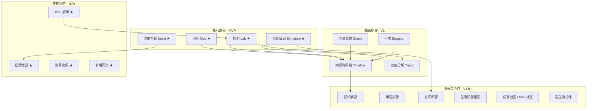

# IBDers（IBD 病程管理系统）：架构分析与技术栈分析

## Report

**What was built** — 基于 PRD 完成全系统架构分析与技术栈定稿：四层拓扑（多端 → Gateway → 领域服务 → AI/推送/存储）、4 子域 18 模块边界与 MVP★ 优先级、本地/云同步双模式 + 信封加密密钥模型、PDF Skill+AI 双引擎管线与降级、HLC 多端冲突策略，以及 Flutter/Taro/React/NestJS/PostgreSQL/Drift/Python Parse Worker 等各域唯一推荐、monorepo 结构与明确不选清单。随后按 MVP 初始化 monorepo 骨架：pnpm workspace、Nest API（health + lab/med/injection/symptom/parse/reminder/sync/auth/patient 内存实现 + Swagger）、Python parse-worker（pymupdf/skill/ai/rules + 样例 Skill + FastAPI）、docker-compose（postgres/redis/api/parse-worker）、domain-types 与 openapi 占位；Flutter/Taro 为 SDK 占位 README。

**Verification** — 文档结构与审查见前。骨架：`pnpm install` + `pnpm --filter @ibd/api build` PASS；`domain-types` typecheck PASS；`python -m py_compile` parse-worker PASS；本地 `node dist/main.js` 后 `GET /health` → 200。本机无 Docker，`docker compose up` 未实跑（ENV）。

**Journey log** — 初稿把「云端只存密文」与服务端解析/预聚合/医生端读写写在一起，复审指出矛盾后改为双模式信封加密（本地 MK / 云同步 AK / 医生 Grant 再包裹）。模块数量曾出现 mermaid 与表格不一致，定稿为 18 模块且 Summary/Report 拆行对齐。排便记录按 PRD 归 V1.0，仅在 Symptom 注记中说明与日记字段的边界，避免静默升优先级。pnpm 全局安装在 `C:\Xiaomi MiMo\pnpm.cmd`，PATH 未刷新时需全路径调用。

## [S1] Problem

`docs/IBD病程管理程序PRD.md` 已定义「IBDers」的完整产品面：检验 PDF 双引擎解析、用药/注射/手术/症状全病程、多端客户端、社区与医患协作。当前仓库只有 PRD，没有任何架构决策或技术选型。需要在动手写代码之前完成两件事：

1. 把 PRD 映射为可落地的系统架构（模块边界、数据流、多端同步、AI 解析管线）。
2. 给出有主次、可分期实施的技术栈推荐，并说明取舍。

## [S2] Design — 架构分析

### S2.1 总体拓扑

```text
                    ┌─────────────────────────────────────┐
                    │           接入层 (API Gateway)        │
                    │  认证 / 限流 / 设备绑定 / 版本协商     │
                    └──────────────────┬──────────────────┘
                                       │
     ┌─────────────┬───────────────────┼───────────────────┬─────────────┐
     │             │                   │                   │             │
┌────▼────┐  ┌─────▼─────┐      ┌──────▼──────┐     ┌──────▼──────┐ ┌────▼────┐
│ Flutter │  │ 微信小程序 │      │   PC Web    │     │  医生端 Web │ │ 未来端  │
│  App    │  │  (轻量)   │      │ (深度分析)  │     │   (V2.0)    │ │         │
└────┬────┘  └─────┬─────┘      └──────┬──────┘     └──────┬──────┘ └────┬────┘
     │ 离线优先     │ 在线为主           │ 在线               │ 授权只读    │
     └─────────────┴───────────────────┴───────────────────┴─────────────┘
                                       │ HTTPS / JSON
                    ┌──────────────────▼──────────────────┐
                    │            领域服务层                 │
                    │  Patient | Lab | Med | Injection     │
                    │  Symptom | Surgery | Timeline        │
                    │  Reminder | Community | Report       │
                    └──────────────────┬──────────────────┘
                                       │
          ┌────────────────────────────┼────────────────────────────┐
          │                            │                            │
   ┌──────▼──────┐             ┌───────▼───────┐            ┌───────▼───────┐
   │ AI 解析管线  │             │  同步/推送服务 │            │  文件/对象存储 │
   │ Skill+LLM   │             │  FCM/APNs/    │            │  PDF/影像/    │
   │ OCR/Vision  │             │  微信订阅消息  │            │  附件         │
   └──────┬──────┘             └───────────────┘            └───────────────┘
          │
   ┌──────▼──────────────────────────────────────────────┐
   │ 数据层：PostgreSQL（主） + Redis（缓存/队列）         │
   │ 对象存储（S3 兼容） + 向量库（可选，Skill 相似度）    │
   └─────────────────────────────────────────────────────┘
```

**分层原则**

| 层 | 职责 | 边界 |
|----|------|------|
| 客户端 | 交互、离线缓存、本地提醒 | 不直接访问数据库；通过统一 API |
| API Gateway | 鉴权、限流、设备识别、API 版本 | 无业务逻辑 |
| 领域服务 | 业务不变式、时间线聚合、权限 | 按限界上下文拆分，可同进程起步 |
| AI 管线 | PDF→结构化数据，Skill 沉淀 | 异步任务，不阻塞用户主路径超过 SLA |
| 数据层 | 持久化、加密、审计 | 本地优先；云同步模式下云端为权威副本（见 S2.3.5） |

### S2.2 限界上下文与模块划分

按 PRD 功能域划为 **4 个子域、18 个模块**（核心病程 4 + 临床扩展 4 + 支撑服务 4 + 增长协作 6）。MVP 只实现标 ★ 的模块。



**模块职责一句话**

| 模块 | 职责 | 主要实体 |
|------|------|----------|
| Lab ★ | 检验结果录入/解析确认/异常标注 | LabResult, LabItem |
| Med ★ | 当前方案、历史切换链、不良反应 | Medication, AdverseEvent |
| Inject ★ | 诱导/维持排期、实际注射、延迟重算 | Injection, InjectionPlan |
| Symptom ★ | 症状日记、打卡；**排便细项 V1.0**（见下注） | SymptomDiary, BathroomRecord, SleepStressRecord |
| Exam | 影像/内镜/病理结构化摘要与评分 | Examination |
| Surgery | 手术结构化字段 + 示意图附件 | Surgery |
| Timeline | 统一事件总线汇聚病程 | TimelineEvent |
| Trend | 多指标趋势、阈值线、用药节点叠加 | TrendSeries（只读聚合） |
| Parse ★ | PDF 双引擎、Skill 版本与共享 | ParseJob, ParseSkill, ParseSkillVersion, ParseReview |
| Remind ★ | 注射/复查/服药提醒与依从性 | ReminderRule, ReminderLog |
| Auth ★ | 注册登录、设备绑定、令牌 | User, Device, RefreshToken |
| Sync ★ | 多端合并、冲突、设备优先 | SyncMeta, Device |
| Flare | 三级预警与 AI 辅助评估 | FlareAssessment |
| Summary | 就诊摘要生成与分享 | GeneratedDoc（type=visit） |
| Report | 年度健康报告与导出 | GeneratedDoc（type=annual） |
| QoL | SF-36 / IBDQ / PHQ-9 量表 | QualitySurvey |
| Comm | 药物评价、同城病友、就诊指南 | DrugReview, GeoGroup |
| Doctor | 授权查看、医学建议标注 | DoctorGrant, DoctorNote |

> **与 PRD 里程碑的显式差异（产品决策，非静默升优先级）**  
> - PRD §七将「排便记录」放在 V1.0，MVP 仅「每日症状日记」。架构上 `SymptomDiary` 在 MVP 必含 Bristol/腹泻次数等日记字段（PRD §2.7.1），`BathroomRecord` 细粒度流水表 **V1.0** 再启用；MVP 不实现独立排便页。  
> - PRD 未把手术模块写入具体里程碑。本分析将 Surgery 放在 V1.0（与检查影像同级），便于时间线完整；若产品希望更晚，只需推迟 Surgery 模块，不影响其它边界。

### S2.3 数据架构

**核心关系（逻辑模型）**

```text
Patient 1──* Medication 1──* AdverseEvent
Patient 1──* LabResult 1──* LabItem
Patient 1──* Examination
Patient 1──* Surgery
Patient 1──* Injection
Patient 1──* SymptomDiary
Patient 1──* BathroomRecord            # V1.0
Patient 1──* SleepStressRecord
Patient 1──* FlareAssessment
Patient 1──* QualitySurvey             # SF-36 / IBDQ / PHQ-9
Patient 1──* GeneratedDoc              # 就诊摘要 / 年度报告
Patient 1──* TimelineEvent             # 由各域投影，可重建
Patient 1──* ReminderRule 1──* ReminderLog
Hospital 1──* ParseSkill 1──* ParseSkillVersion
ParseJob *──1 ParseSkill?              # 命中模板时关联
ParseJob 1──0..1 LabResult             # 解析产物：一次任务至多一份 LabResult
User 1──* Device
User 1──* DrugReview
User 1──* GeoGroup?  /  GeoGroup 1──* User
DoctorGrant: Patient 1──* Doctor  (时效、范围)
```

**关键设计决策**

1. **本地优先 + 云同步可选（双模式）**  
   - **本地模式**：App 内嵌加密 SQLite/Drift，唯一权威数据在设备；不上传病历明文。  
   - **云同步模式**（用户显式开启）：云端 PostgreSQL 为多端权威副本，App/Web 共享同一账号数据。  
   - 两种模式对应 PRD §4.1「本地存储优先，云同步可选」；关闭同步后云端历史可按策略删除。

2. **Timeline 为投影而非事实源**  
   - 事实源在各域表；`timeline_events` 由写入时异步投影。  
   - 支持按类型筛选、按年/月缩放、导出 PDF，且可重放重建。

3. **LabItem 中文规范名 + 别名映射**  
   - 存储 `name_norm`（规范中文）、`name_raw`（报告原文）、`aliases[]`。  
   - 趋势图、就诊摘要、阈值线只依赖 `name_norm`（如「超敏C反应蛋白」）。

4. **ParseSkill 版本化**  
   - Skill 内容不可变，只追加 `ParseSkillVersion`。  
   - 用户修正 → 新版本；社区共享发布某一版本；准确率/使用量挂在版本上。

5. **加密与密钥（信封加密，避免与服务端能力矛盾）**  
   - 传输始终 TLS1.3。  
   - **每条敏感记录一把 DEK**（AES-256-GCM 字段级：检验值、症状自由文本、手术所见等）。  
   - 用户主密钥 `MK` 由口令经 Argon2id 派生，**永不上传**。  
   - **云同步模式**：DEK 用账号密钥 `AK` 包裹后随记录上云；`AK` 在启用同步时生成，服务端持有 `AK` 的受控副本以便：Parse Worker 写 LabResult、服务端预聚合趋势、多端解密。退出同步则销毁服务端 `AK`。  
   - **医生端**：患者授权时将指定数据范围的 DEK（或子集 `AK`）经医生公钥再包裹，写入 `DoctorGrant`；可收回、可过期。  
   - **本地模式**：仅 `MK` 派生密钥解密，服务端无明文、无 `AK`。  
   - 设备侧关键路径：生物解锁、备份密钥托管（用户选择是否 iCloud/助记词）、root/越狱检测降级策略——实现阶段必须单列。

### S2.4 AI 解析管线（双引擎）

```text
                    PDF 上传
                       │
                       ▼
              ┌────────────────┐
              │ 文本层抽取      │  pymupdf：文字型 PDF 直接出文本
              │ 否则栅格化 3x   │  扫描/拍照型 → 高清图
              └────────┬───────┘
                       ▼
              ┌────────────────┐
              │ Skill 路由      │  hospital + report_type 匹配
              └────────┬───────┘
            命中│              │未命中/部分失败
                ▼              ▼
        ┌──────────────┐  ┌─────────────────┐
        │ 模板正则提取  │  │ LLM / VLM 结构化 │
        │ special_rules │  │ + 规则后校验     │
        └──────┬───────┘  └────────┬────────┘
               └──────────┬────────┘
                          ▼
                 用户确认/修正 UI
                          │
          ┌───────────────┼───────────────┐
          ▼               ▼               ▼
     写入 LabResult   Skill 新建/升版   反馈准确率指标
```

**与加密/双模式的关系**  
- 云同步模式：PDF 与解析任务在云端 Worker 执行，结果经 `AK` 写入（见 S2.3.5）。  
- 本地模式：解析在设备侧调用同一 Python Worker 镜像或受控远程「仅文本出、不留存」通道；若离线则只能手动录入。

**管线契约**

| 阶段 | 输入 | 输出 | SLA |
|------|------|------|-----|
| 抽取 | PDF bytes | text 或 page images | <1s |
| Skill 命中 | hospital/type 或嵌入 | skill_version_id? | <50ms |
| 模板解析 | skill + text | partial items[] | <1s |
| AI 解析 | text/images + schema | items[] + confidence | 3–10s |
| 规则校验 | items[] + special_rules | filtered items[] | <100ms |
| 用户确认 | draft items[] | LabResult + skill feedback | 用户主导 |

**降级路径**：Skill 失败 → AI 全量 → 人工录入；AI 超时/额度尽 → 保留草稿，离线可手动补。

### S2.5 多端与同步

| 端 | 数据策略 | 离线 | 推送 | 功能边界（对齐 PRD §4.2.6） |
|----|----------|------|------|---------------------------|
| Flutter App | 本地权威或全量同步镜像 + 本地写 | 症状打卡；本地模式全功能；云模式已下载报告可读 | 系统级（FCM/APNs + 厂商通道） | 日记/排便/提醒/预警/PDF 拍照/基础趋势 |
| 微信小程序 | 按需拉取，不缓存敏感全量 | 无 | 订阅消息 | 查看、简化趋势、就诊摘要分享、Skill 浏览；**不做** PDF 解析、独立排便、年度报告 |
| PC Web | 在线；批量操作缓冲 | 无 | 无 | 批量 PDF、完整趋势、手术编辑、导出、Skill 管理 |
| 医生端 | 授权患者子集只读 | 无 | 无 | 查看日记/检验/预警/摘要；标注建议；无社区 |

**冲突解决（PRD 4.2.7）——定稿选 `HLC + device_id`**

- 每条记录带 `hlc`（混合逻辑时钟）与 `device_id`，乐观锁比较 `(hlc, device_id)`。  
- 同设备优先：客户端 `last_local_write_at` 大于服务端版本时保留本地。  
- 不可自动合并的自由文本（如手术所见）保留双版本，UI 提示合并。  
- 不引入完整向量时钟（单患者写入方少，HLC 足够且实现简单）。

### S2.6 安全与合规边界

- 账号：手机号 + 微信 OAuth；设备绑定表可撤销。  
- 医生端：执业信息人工/第三方核验；患者扫码授权（DEK 再包裹，见 S2.3.5），时效可收回；审计日志。  
- 社区：默认匿名（昵称+城市）；药物评价不含可识别病历。  
- 导出：用户触发，在持有密钥的客户端解密后生成 JSON/PDF/DOCX；服务端不持久化导出明文。  
- 本地模式风险面：设备备份、生物识别旁路、越狱/root——列入实现阶段安全清单（见 S2.3.5）。

### S2.7 里程碑 → 架构落地顺序

| 阶段 | 必须先有的架构能力 | 可延后 |
|------|-------------------|--------|
| MVP | Auth、Lab/Med/Inject、Symptom（日记字段）、Parse 双引擎骨架、Remind、App+小程序壳、Sync 最小版、双模式加密骨架 | 社区、医生端、向量库、年度报告、独立排便页 |
| V1.0 | Exam、**Surgery（分析建议位，PRD 未写死）**、Timeline、Trend、BathroomRecord、PC Web 批量与图表 | Flare AI、饮食 |
| V1.5 | Summary/Report 导出、Flare 三级预警、量表、数据导出 | 全量医院 Skill 覆盖 |
| V2.0 | Doctor 协作、Comm、AI 辅助分析、同城 | — |

## [S2b] Design — 技术栈分析

### S2b.1 推荐总览（定稿）

| 域 | 选型 | 备选 | 为何选它 |
|----|------|------|----------|
| 移动 App | **Flutter 3.x + Drift(SQLite)** | React Native | PRD 已倾向跨端一套代码；本地 DB/加密/后台任务生态成熟；IBD 高频表单在 Flutter 里性能与一致性更稳 |
| 小程序 | **Taro 3 + React**（与 PC 同语言栈） | uni-app、原生 | 团队心智一套；与 Web 共享组件与类型；不做重交互，Taro 足够 |
| PC Web | **React 18 + TypeScript + Vite + ECharts** | Vue3 | 趋势图/多指标叠加 ECharts 最省事；与 Taro 同 React 降低上下文切换 |
| 医生端 | **React + 同一 API 契约，独立路由与鉴权** | 独立 Vue 应用（不推荐，重复组件） | 与 PC 共享图表与摘要组件，数据权限在服务端强制 |
| API | **TypeScript NestJS（模块化单体起步）** | FastAPI、Go | 与前端同语言；按限界上下文划 Nest Module（非 CQRS），后续可把 Parse Worker、Remind Worker 拆进程 |
| 主库 | **PostgreSQL 16** | MySQL | JSONB 存 Skill/草稿/灵活项；行级安全便于医生授权；全文/未来检索够用 |
| 本地库 | **Drift（SQLite）** | Hive/Isar | 关系模型贴合检验/用药；支持加密 SQLCipher |
| 缓存/队列 | **Redis + BullMQ** | RabbitMQ | 解析异步、提醒调度、限流一体 |
| 对象存储 | **S3 兼容（阿里 OSS / MinIO）** | — | PDF 原件、影像、手术图；预签名直传 |
| AI 文本 | **OpenAI 兼容 API（可切换国内供应商）** | — | 结构化 JSON 输出；供应商可插拔避免绑定 |
| AI 视觉 | **多模态模型（GPT-4o 级 / 国内 VLM）** | 自建 OCR | 扫描件/手写；成本用 Skill 命中率压降 |
| PDF | **PyMuPDF (fitz) 独立 Python Worker** | pdf.js 主进程 | PRD 已点名；Worker 语言可与主服务不同 |
| 推送 | **FCM + APNs + 厂商通道 + 微信订阅消息** | — | 国内 Android 必须厂商通道 |
| 鉴权 | **JWT（短时）+ Refresh 旋转 + 设备绑定** | 纯 Session | 多端 + 离线刷新场景 |
| 可观测 | **OpenTelemetry + Sentry** | — | 解析失败与同步冲突是核心排障点 |
| IaC | **Docker Compose 起步 → 可迁 K8s** | — | MVP 单机可运维 |

### S2b.2 关键取舍说明

**1. 为什么 App 选 Flutter 而不是 React Native**  
- 本地加密 DB、后台任务、相机拍 PDF 这类能力 Flutter 插件面完整。  
- 自定义趋势图与 Bristol 量表等交互在 Flutter 渲染性能可预期。  
- 若团队 RN 资产极重可改 RN，但当前绿地无历史包袱，Flutter 更贴「离线优先病程本」。

**2. 为什么后端是 TS 模块化单体，而不是一上来微服务**  
- MVP 限界上下文共享 Patient 身份与同步元数据，过早拆服务只会增加分布式税。  
- Nest 模块边界 = 未来拆分缝；Parse/Remind 已是天然 Worker，先用队列进程隔离即可。  
- Python 只承担「PDF/AI Worker」——重库生态在 Python，主业务不必跟过去。

**3. 为什么 Skill 用关系库 + 版本表，而不是「文件式 Skill 包」全量上 IPFS**  
- 需要准确率、使用量、社区评分、按医院查询——本质是产品数据。  
- 规则体本身放 JSONB，校验用受限表达式（白名单 AST），避免 `eval` 任意代码。

**4. 为什么趋势图选 ECharts 而不是 D3**  
- 多指标叠加、阈值线、dataZoom、中文标签是 ECharts 开箱能力。  
- D3 灵活但成本高，不符合「图表渲染 <1s」的交付节奏。

**5. AI 供应商策略**  
- 定义 `LLMPort` 接口：`complete_json(schema, messages, images?)`。  
- 配置多供应商，Skill 命中后短路，降低单位解析成本。  
- 所有 AI 出参必须过 JSON Schema + 规则校验，禁止裸信模型。

### S2b.3 建议仓库结构（monorepo）

```text
ibd-management/
├── apps/
│   ├── mobile/                 # Flutter
│   ├── miniapp/                # Taro
│   ├── web/                    # React PC
│   └── doctor-web/             # React 医生端
├── services/
│   ├── api/                    # NestJS 模块化单体
│   └── parse-worker/           # Python: pymupdf + LLM + Skill
├── packages/
│   ├── api-client/             # OpenAPI 生成的 TS 客户端
│   ├── domain-types/           # 共享实体与枚举（中文规范指标名表）
│   └── ui-tokens/              # 设计令牌（可选）
├── docs/
│   ├── IBD病程管理程序PRD.md
│   └── compose/spec/
├── docker-compose.yml
└── openapi.yaml
```

### S2b.4 性能与成本控制

| 指标 | 策略 |
|------|------|
| PDF 解析 <5s | Skill 热路径 <1s；AI 路径异步 + 进度推送；首包文本抽取并行 |
| 图表 <1s | 服务端预聚合月度桶；客户端只拉序列不拉原始全表 |
| 同步延迟 <3s | 增量游标 + Redis 在线设备直推；冲突极少走合并 UI |
| LLM 成本 | 工程目标：Top 医院 Skill 路由命中后跳过 LLM；PRD 的 80% 是「Top50 医院覆盖患者」不是命中率。图片页数截断；同 hash PDF 缓存 |

### S2b.5 明确不选的技术（及原因）

| 不选 | 原因 |
|------|------|
| 纯小程序无 App | 离线日记、系统推送、拍照解析做不稳 |
| 区块链存证病历 | 无产品收益，合规与性能成本高 |
| 自研 OCR 替代 VLM | 精度与维护成本不划算；VLM + Skill 已够 |
| Electron 打包 PC | PRD 定位 Web 即可；无重度本地文件需求 |
| GraphQL 全面替换 REST | 病程读写形状稳定，REST + BFF 更简单；报表用专用端点 |

## [S3] Out of Scope

- 不实现任何业务代码、CI、部署脚本。  
- 不选定具体云厂商合同价与 ICP/等保材料清单（仅指出需要合规评估）。  
- 不展开 UI 视觉规范与信息架构线框。  
- 不对 PRD 功能优先级做产品层否决（架构按 PRD 里程碑适配）。  
- 医生端执业核验供应商、实名方案留给合规评审。

## Tasks

- [x] T1: 通读 PRD 并提取架构约束 — acceptance: 功能域、数据实体、多端矩阵、非功能需求均有对应架构结论 (covers: S2)
- [x] T2: 产出系统总体架构与模块边界 — acceptance: 拓扑图 + 限界上下文表 + 数据架构决策可追溯至 PRD 章节 (covers: S2; depends: T1)
- [x] T3: 产出 AI 解析与多端同步设计 — acceptance: 双引擎流程、降级路径、冲突策略写清 (covers: S2)
- [x] T4: 产出技术栈定稿与取舍 — acceptance: 每域有唯一推荐、备选与否决原因 (covers: S2b; depends: T2)
- [x] T5: 给出 monorepo 结构与里程碑落地顺序 — acceptance: MVP/V1/V2 能力与模块可对齐 (covers: S2b, S2)
- [x] T6: （后续）按 MVP 范围初始化 monorepo 与 Nest/Flutter/Parse Worker 骨架 — acceptance: 空壳可 docker compose 起 API 与 parse-worker（covers: S2b; depends: T2, T4）
